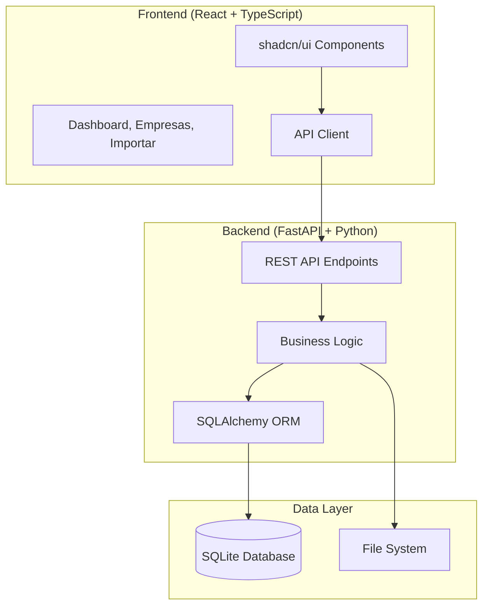

# 🗂️ Sistema de Gerenciamento de IDs

> **Sistema completo para organização automática de documentos com numeração padronizada e estrutura de pastas espelho.**

[](https://fastapi.tiangolo.com/)
[](https://reactjs.org/)
[](https://www.typescriptlang.org/)
[](https://tailwindcss.com/)
[](https://www.sqlite.org/)

---

## 📑 Índice

- [🎯 Visão Geral](#-visão-geral)
- [✨ Principais Funcionalidades](#-principais-funcionalidades)
- [🏗️ Arquitetura do Sistema](#️-arquitetura-do-sistema)
- [📋 Modelo de Dados](#-modelo-de-dados)
- [🔤 Sistema de Numeração](#-sistema-de-numeração)
- [📁 Estrutura de Pastas](#-estrutura-de-pastas)
- [🚀 Instalação e Configuração](#-instalação-e-configuração)
- [💻 Como Usar](#-como-usar)
- [🔧 Desenvolvimento](#-desenvolvimento)
- [📊 API Documentation](#-api-documentation)
- [🧪 Testes](#-testes)
- [🤝 Contribuição](#-contribuição)

---

## 🎯 Visão Geral

O **Sistema de Gerenciamento de IDs** é uma solução completa para empresas que precisam organizar documentos de forma padronizada e automática. O sistema cria uma estrutura hierárquica de **Empresas** → **Unidades** → **Itens**, onde cada nível possui identificadores únicos e pastas espelho no sistema de arquivos.

### 🎨 Interface Principal
- **Frontend:** React 19 + TypeScript + shadcn/ui + Tailwind CSS
- **Backend:** FastAPI + SQLAlchemy + SQLite
- **Padrão:** Desktop-first com responsividade

### 🔑 Conceitos Principais
- **Empresa:** Entidade principal (ID: 0001, 0002, ...)
- **Unidade:** Divisões da empresa (ID: 001, 002, ... por empresa)
- **Item:** Documentos com tags específicas (FAT, NE, REL, etc.)
- **Pastas Espelho:** Estrutura automática no filesystem

---

## ✨ Principais Funcionalidades

### 🏢 Gestão de Empresas
- ✅ Cadastro automático com ID sequencial (0001, 0002, ...)
- ✅ Criação automática da primeira unidade (001)
- ✅ Geração de estrutura de pastas completa
- ✅ Validação de nomes e siglas

### 🏭 Gestão de Unidades
- ✅ Numeração sequencial por empresa (001, 002, ...)
- ✅ Subpastas padrão automáticas:
  - `Faturas/`
  - `Notas de Energia/`
  - `Relatórios e Resultados/`
  - `Estudos e Análises/`
  - `Documentos do Cliente/`
  - `CCEE - DRI/` (com subtipos organizados)

### 📄 Organização de Documentos
- ✅ **Import automático** com preview e validação
- ✅ **Renomeação inteligente** baseada em padrões
- ✅ **Validação de formato** com regex específicas
- ✅ **Movimentação segura** com backup de segurança

### 🔍 Tipos de Documentos Suportados
| Tipo | Formato | Exemplo |
|------|---------|---------|
| **FAT** | `FAT-AAAA-MM` | `FAT-2025-08.pdf` |
| **NE** | `NE-(CP\\|LP)-AAAA-MM` | `NE-CP-2025-08.pdf` |
| **REL** | `REL-AAAA-MM` | `REL-2025-08.xlsx` |
| **EST** | `EST-AAAA-MM` | `EST-2025-08.pdf` |
| **DOC** | `DOC-<SUB>-AAAA[-MM][-extras]` | `DOC-CTR-2025-03-18.pdf` |
| **CCEE** | `CCEE-<COD><SUB>-AAAA-MM[-V][-X]` | `CCEE-CFZ003-2025-04-V2.xlsx` |

---

## 🏗️ Arquitetura do Sistema



### 📦 Stack Tecnológica

#### 🎨 Frontend
- **React 19.1.1** - Library UI moderna
- **TypeScript 5.8.3** - Type safety
- **Vite 7.1.2** - Build tool ultrarrápida  
- **shadcn/ui** - Componentes acessíveis
- **Tailwind CSS 3.4.17** - Styling utility-first
- **Lucide React** - Ícones modernos

#### ⚡ Backend
- **FastAPI 0.116.1** - Framework web moderno
- **SQLAlchemy 2.0.43** - ORM Python
- **Pydantic 2.11.7** - Validação de dados
- **Uvicorn 0.35.0** - ASGI server
- **SQLite** - Database leve e eficiente

#### 🛠️ DevTools
- **ESLint** - Linting TypeScript/React
- **PostCSS** - CSS processing
- **Autoprefixer** - CSS compatibility
- **Hot Module Replacement** - Development experience

---

## 📋 Modelo de Dados

### 🗄️ Estrutura do Banco

```sql
-- Tabela de Empresas
CREATE TABLE empresas (
    id INTEGER PRIMARY KEY AUTOINCREMENT,
    id_empresa TEXT UNIQUE NOT NULL,  -- "0001", "0002", ...
    nome TEXT NOT NULL,               -- "CEOLIN ENERGIA LTDA"
    sigla TEXT,                       -- "CEOLIN" (opcional)
    created_at TIMESTAMP DEFAULT CURRENT_TIMESTAMP
);

-- Tabela de Unidades
CREATE TABLE unidades (
    id INTEGER PRIMARY KEY AUTOINCREMENT,
    id_unidade TEXT NOT NULL,         -- "001", "002", ...
    nome TEXT NOT NULL,               -- "Matriz", "Filial SP"
    empresa_id INTEGER NOT NULL,
    created_at TIMESTAMP DEFAULT CURRENT_TIMESTAMP,
    FOREIGN KEY (empresa_id) REFERENCES empresas (id),
    UNIQUE (empresa_id, id_unidade)   -- Único por empresa
);

-- Tabela de Itens (documentos)
CREATE TABLE itens (
    id INTEGER PRIMARY KEY AUTOINCREMENT,
    nome_arquivo TEXT NOT NULL,       -- Nome final do arquivo
    caminho_origem TEXT,              -- Caminho original
    caminho_destino TEXT,             -- Caminho final
    tipo TEXT,                        -- FAT, NE, REL, etc.
    unidade_id INTEGER NOT NULL,
    created_at TIMESTAMP DEFAULT CURRENT_TIMESTAMP,
    FOREIGN KEY (unidade_id) REFERENCES unidades (id)
);
```

### 🔗 Relacionamentos
- **Empresa** 1:N **Unidade** 1:N **Item**
- **Foreign Keys** com integridade referencial
- **Constraints** para unicidade de IDs

---

## 🔤 Sistema de Numeração

### 🏢 Empresas
- **Formato:** `0001`, `0002`, `0003`, ...
- **Zero-padded:** 4 dígitos
- **Sequencial:** Auto-incremento global

### 🏭 Unidades  
- **Formato:** `001`, `002`, `003`, ...
- **Zero-padded:** 3 dígitos
- **Sequencial:** Reinicia para cada empresa
- **Primeira unidade:** Sempre `001` (criada automaticamente)

### 📄 Itens (Documentos)

#### 📊 FAT - Faturas
```
Formato: FAT-AAAA-MM[.extensão]
Exemplo: FAT-2025-08.pdf
```

#### ⚡ NE - Notas de Energia
```
Formato: NE-(CP|LP)-AAAA-MM[.extensão]
Exemplos: 
  - NE-CP-2025-08.pdf (Conta de Energia - Posto A4)
  - NE-LP-2025-08.pdf (Leitura e Perdas)
```

#### 📈 REL - Relatórios
```
Formato: REL-AAAA-MM[.extensão]
Exemplo: REL-2025-08.xlsx
```

#### 🔬 EST - Estudos
```
Formato: EST-AAAA-MM[.extensão]
Exemplo: EST-2025-08.pdf
```

#### 📋 DOC - Documentos do Cliente
```
Formato: DOC-<SUBTIPO>-AAAA[-MM][-extras][.extensão]
Subtipos: CTR, ADT, CAD, PRO, CAR, COM, LIC
Exemplos:
  - DOC-CTR-2025.pdf (Contrato)
  - DOC-ADT-2025-03-18.pdf (Aditivo)
  - DOC-COM-2025-08-001.xlsx (Comercial)
  - DOC-PRO-2025-V2.pdf (Processo)
```

#### 🏛️ CCEE - Câmara de Comercialização de Energia
```
Formato: CCEE-<CODIGO><SUBTIPO>-AAAA-MM[-V<versão>][-<extra>][.extensão]
Códigos: CFZ, GFN, LFN, LFRCA, LFRES, PEN, SUM
Subtipos: 001, 002, 003, ...
Exemplos:
  - CCEE-CFZ003-2025-04.pdf
  - CCEE-GFN001-2025-04-V2.xlsx
  - CCEE-SUM001-2025-04-C.csv
```

---

## 📁 Estrutura de Pastas

### 🏗️ Hierarquia Automática

```
📁 BASE_DIR/
├── 📁 CEOLIN - 0001/                    # {SIGLA} - {id_empresa}
│   ├── 📁 Matriz - 001/                 # {nome} - {id_unidade}
│   │   ├── 📁 Faturas/                  # Arquivos FAT-*
│   │   ├── 📁 Notas de Energia/         # Arquivos NE-* (CP e LP juntos)
│   │   ├── 📁 Relatórios e Resultados/ # Arquivos REL-*
│   │   ├── 📁 Estudos e Análises/       # Arquivos EST-*
│   │   ├── 📁 Documentos do Cliente/    # Arquivos DOC-*
│   │   └── 📁 CCEE - DRI/               # Arquivos CCEE-*
│   │       ├── 📁 CFZ003/               # Uma pasta por tipo
│   │       ├── 📁 GFN001/
│   │       └── 📁 SUM001/
│   │
│   └── 📁 Filial SP - 002/
│       ├── 📁 Faturas/
│       └── ... (mesma estrutura)
│
└── 📁 ENERGISA - 0002/
    └── 📁 Sede - 001/
        └── ... (mesma estrutura)
```

### 📋 Regras de Organização

1. **Criação automática** de todas as pastas ao cadastrar unidade
2. **Detecção inteligente** do tipo de arquivo por regex
3. **Movimentação segura** com preview obrigatório
4. **Backup automático** antes de mover arquivos
5. **Validação de nomes** antes da importação

---

## 🚀 Instalação e Configuração

### 📋 Pré-requisitos

- **Python 3.11+** 
- **Node.js 18+**
- **npm ou yarn**
- **Git**

### ⚡ Instalação Rápida

```bash
# 1. Clone o repositório
git clone https://github.com/luiz-custodio/id-management.git
cd id-management

# 2. Configure o Backend
cd backend
python -m venv venv
source venv/bin/activate  # Windows: venv\Scripts\activate
pip install -r requirements.txt

# 3. Configure o Frontend  
cd ../frontend
npm install

# 4. Configure variáveis de ambiente
cp .env.example .env
# Edite o .env com suas configurações
```

### ⚙️ Configuração de Ambiente

#### Backend `.env`
```bash
# Database
DATABASE_URL=sqlite:///./ids.db

# File System
BASE_DIR=B:\\NOVO00_Nossos_Clientes

# API
API_HOST=0.0.0.0
API_PORT=8000
```

#### Frontend `.env`
```bash
# API Base URL
VITE_API_URL=http://localhost:8000

# Base Directory (mesmo do backend)
VITE_BASE_DIR=B:\\NOVO00_Nossos_Clientes
```

### 🗄️ Inicialização do Database

```bash
cd backend
python -c "from app.database import Base, engine; Base.metadata.create_all(bind=engine)"
```

---

## 💻 Como Usar

### 🚀 Iniciar o Sistema

```bash
# Terminal 1: Backend
cd backend
uvicorn app.main:app --reload --host 0.0.0.0 --port 8000

# Terminal 2: Frontend  
cd frontend
npm run dev
```

**URLs de Acesso:**
- 🎨 **Frontend:** http://localhost:5173
- 🔧 **API Docs:** http://localhost:8000/docs
- 📚 **ReDoc:** http://localhost:8000/redoc

### 📖 Fluxo de Trabalho

#### 1. 🏢 Cadastrar Empresa
1. Acesse **Empresas** no menu
2. Clique **"Nova Empresa"**
3. Preencha nome e sigla
4. Informe nome da primeira unidade
5. ✅ Sistema cria automaticamente:
   - ID da empresa (ex: 0001)
   - Primeira unidade (001)
   - Estrutura de pastas completa

#### 2. 🏭 Adicionar Unidades (Opcional)
1. Selecione a empresa
2. Clique **"Nova Unidade"**
3. Informe o nome
4. ✅ Sistema cria:
   - ID sequencial (002, 003, ...)
   - Estrutura de pastas

#### 3. 📄 Importar Documentos
1. Acesse **"Upload/Importar"**
2. Selecione **Empresa** e **Unidade**
3. Cole os **caminhos absolutos** dos arquivos
4. Clique **"Pré-visualizar"**
5. ✅ Revise a tabela de preview:
   - ✅ Verde = arquivo válido
   - ⚠️ Amarelo = problema encontrado
6. Clique **"Aplicar movimentação"**
7. ✅ Arquivos organizados automaticamente!

#### 4. 📊 Monitorar Dashboard
- Estatísticas em tempo real
- Atividades recentes
- Ações rápidas
- Status do sistema

---

## 🔧 Desenvolvimento

### 🏗️ Estrutura do Projeto

```
id-management/
├── 📁 backend/                  # FastAPI Backend
│   ├── 📁 app/
│   │   ├── __init__.py
│   │   ├── main.py             # FastAPI app
│   │   ├── database.py         # SQLAlchemy config
│   │   ├── models.py           # Database models
│   │   ├── schemas.py          # Pydantic schemas
│   │   ├── id_utils.py         # ID generation logic
│   │   ├── fs_utils.py         # File system operations
│   │   └── organizer.py        # Document organization
│   ├── ids.db                  # SQLite database
│   └── requirements.txt
│
├── 📁 frontend/                 # React Frontend
│   ├── 📁 src/
│   │   ├── 📁 components/
│   │   │   └── 📁 ui/          # shadcn/ui components
│   │   ├── 📁 lib/
│   │   │   ├── utils.ts        # Utility functions
│   │   │   └── api.ts          # API client
│   │   ├── 📁 pages/           # Page components
│   │   ├── App.tsx             # Main app
│   │   ├── main.tsx            # Entry point
│   │   └── index.css           # Global styles
│   ├── package.json
│   ├── vite.config.ts
│   ├── tailwind.config.js
│   └── tsconfig.json
│
├── 📁 docs/                     # Documentation
├── 📁 scripts/                  # Utility scripts
└── README.md                    # This file
```

### 🧪 Comandos de Desenvolvimento

```bash
# Backend
cd backend
python -m uvicorn app.main:app --reload    # Dev server
python -m pytest                          # Run tests
python -m black .                         # Format code
python -m flake8                          # Lint code

# Frontend
cd frontend
npm run dev                               # Dev server
npm run build                            # Production build
npm run preview                          # Preview build
npm run lint                             # Lint code
```

### 🔍 Debugging

#### Backend Debugging
```python
# Adicione breakpoints no código
import pdb; pdb.set_trace()

# Ou use logging
import logging
logging.basicConfig(level=logging.DEBUG)
```

#### Frontend Debugging
```typescript
// Console debugging
console.log('Debug:', data)

// React DevTools
// Chrome Extension: React Developer Tools
```

### 📝 Convenções de Código

#### Python (Backend)
- **PEP 8** style guide
- **Type hints** obrigatórios
- **Docstrings** para funções públicas
- **Pytest** para testes

#### TypeScript (Frontend)
- **ESLint** configuration
- **Prettier** formatting
- **Componentes funcionais** com hooks
- **Props tipadas** com interfaces

---

## 📊 API Documentation

### 🔗 Principais Endpoints

#### 🏢 Empresas
```http
GET    /empresas              # Listar empresas
POST   /empresas              # Criar empresa
GET    /empresas/{id}         # Buscar empresa
PUT    /empresas/{id}         # Atualizar empresa
DELETE /empresas/{id}         # Excluir empresa
```

#### 🏭 Unidades
```http
GET    /unidades                           # Listar unidades
POST   /unidades                           # Criar unidade
GET    /unidades?empresa_id={id}           # Listar por empresa
GET    /unidades/{id}                      # Buscar unidade
PUT    /unidades/{id}                      # Atualizar unidade
DELETE /unidades/{id}                      # Excluir unidade
```

#### 📄 Organizador
```http
POST   /organizador/preview               # Preview de importação
POST   /organizador/aplicar               # Aplicar movimentação
```

### 📋 Schemas de Dados

#### Empresa
```typescript
interface EmpresaCreate {
  nome: string;                    // "CEOLIN ENERGIA LTDA"
  sigla?: string;                  // "CEOLIN" (opcional)
  unidade_001_nome: string;        // "Matriz"
}

interface EmpresaOut {
  id: number;
  id_empresa: string;              // "0001"
  nome: string;
  sigla?: string;
  created_at: string;
}
```

#### Unidade
```typescript
interface UnidadeCreate {
  nome: string;                    // "Filial SP"
  empresa_id: number;
}

interface UnidadeOut {
  id: number;
  id_unidade: string;              // "002"
  nome: string;
  empresa_id: number;
  created_at: string;
}
```

#### Preview
```typescript
interface Preview {
  origem: string;                  // Caminho original
  destino?: string;                // Caminho final
  pasta_relativa?: string;         // Pasta de destino
  tipo_detectado?: string;         // FAT, NE, REL, etc.
  valido: boolean;                 // Válido para import?
  motivo?: string;                 // Motivo se inválido
}
```

---

## 🧪 Testes

### 🔬 Backend Tests

```bash
cd backend
python -m pytest -v                # Todos os testes
python -m pytest tests/test_api.py # API tests
python -m pytest --cov=app         # Coverage report
```

#### Exemplo de Test
```python
def test_criar_empresa(client):
    response = client.post("/empresas", json={
        "nome": "Empresa Teste",
        "sigla": "TESTE",
        "unidade_001_nome": "Matriz"
    })
    assert response.status_code == 200
    data = response.json()
    assert data["nome"] == "Empresa Teste"
    assert data["id_empresa"] == "0001"
```

### 🔬 Frontend Tests

```bash
cd frontend
npm run test                      # Unit tests
npm run test:watch              # Watch mode
npm run test:coverage           # Coverage
```

#### Exemplo de Test
```typescript
import { render, screen } from '@testing-library/react'
import App from './App'

test('renders dashboard', () => {
  render(<App />)
  const linkElement = screen.getByText(/Sistema de IDs/i)
  expect(linkElement).toBeInTheDocument()
})
```

---

## 🤝 Contribuição

### 🛠️ Como Contribuir

1. **Fork** o repositório
2. **Clone** seu fork localmente
3. **Crie** uma branch para sua feature
4. **Commit** suas mudanças
5. **Push** para sua branch
6. **Abra** um Pull Request

```bash
# Workflow de contribuição
git clone https://github.com/SEU-USUARIO/id-management.git
cd id-management
git checkout -b feature/nova-funcionalidade

# Faça suas mudanças...
git add .
git commit -m "feat: adiciona nova funcionalidade"
git push origin feature/nova-funcionalidade

# Abra um Pull Request no GitHub
```

### 📏 Diretrizes

#### Commit Messages
Seguimos o padrão **Conventional Commits**:

```bash
feat: adiciona suporte para novos tipos de documento
fix: corrige validação de arquivos CCEE
docs: atualiza documentação da API
style: formata código com prettier
refactor: reorganiza estrutura de pastas
test: adiciona testes para organizer
chore: atualiza dependências
```

#### Code Review
- ✅ **Código testado** e funcionando
- ✅ **Documentação** atualizada
- ✅ **Testes** passando
- ✅ **Linting** sem erros
- ✅ **Performance** mantida ou melhorada

---

## 📞 Suporte e Contato

### 🐛 Reportar Bugs
- **GitHub Issues:** [Criar issue](https://github.com/luiz-custodio/id-management/issues)
- **Template:** Use o template de bug report
- **Informações:** Sistema operacional, versões, logs

### 💡 Solicitar Features
- **GitHub Discussions:** [Nova discussão](https://github.com/luiz-custodio/id-management/discussions)
- **RFC:** Para features grandes, crie um RFC
- **Detalhamento:** Descreva caso de uso e justificativa

### 📚 Documentação
- **Wiki:** [Documentação adicional](https://github.com/luiz-custodio/id-management/wiki)
- **Examples:** Pasta `/examples` com casos de uso
- **API Docs:** Swagger UI disponível em `/docs`

---

## 📄 Licença

Este projeto está licenciado sob a **MIT License**. Veja o arquivo [LICENSE](LICENSE) para detalhes.

```
MIT License

Copyright (c) 2025 Sistema de Gerenciamento de IDs

Permission is hereby granted, free of charge, to any person obtaining a copy
of this software and associated documentation files (the "Software"), to deal
in the Software without restriction, including without limitation the rights
to use, copy, modify, merge, publish, distribute, sublicense, and/or sell
copies of the Software, and to permit persons to whom the Software is
furnished to do so, subject to the following conditions:

The above copyright notice and this permission notice shall be included in all
copies or substantial portions of the Software.

THE SOFTWARE IS PROVIDED "AS IS", WITHOUT WARRANTY OF ANY KIND, EXPRESS OR
IMPLIED, INCLUDING BUT NOT LIMITED TO THE WARRANTIES OF MERCHANTABILITY,
FITNESS FOR A PARTICULAR PURPOSE AND NONINFRINGEMENT. IN NO EVENT SHALL THE
AUTHORS OR COPYRIGHT HOLDERS BE LIABLE FOR ANY CLAIM, DAMAGES OR OTHER
LIABILITY, WHETHER IN AN ACTION OF CONTRACT, TORT OR OTHERWISE, ARISING FROM,
OUT OF OR IN CONNECTION WITH THE SOFTWARE OR THE USE OR OTHER DEALINGS IN THE
SOFTWARE.
```

---

## 🏆 Agradecimentos

- **[FastAPI](https://fastapi.tiangolo.com/)** - Framework web moderno e rápido
- **[React](https://reactjs.org/)** - Library para interfaces de usuário
- **[shadcn/ui](https://ui.shadcn.com/)** - Componentes acessíveis e customizáveis
- **[Tailwind CSS](https://tailwindcss.com/)** - Framework CSS utility-first
- **[Vite](https://vitejs.dev/)** - Build tool ultrarrápida
- **[TypeScript](https://www.typescriptlang.org/)** - JavaScript com tipos estáticos

---

<div align="center">

**⭐ Se este projeto foi útil, considere dar uma estrela!**

[](https://github.com/luiz-custodio/id-management/stargazers)
[](https://github.com/luiz-custodio/id-management/network/members)

**Desenvolvido com ❤️ para automatizar a organização de documentos**

</div>
